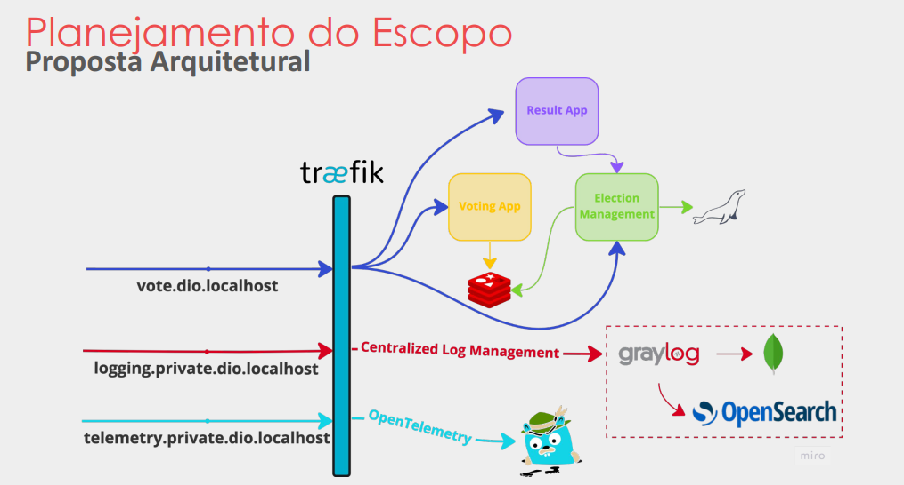

# LAB Quarkus - DIO - Java AI Powered

###### Desafio de Projeto
## Desenvolvendo um Sistema para Eleição usando Quarkus Framework

#### - Projeto em Quarkus do BootCamp Java AI Powered ministrado pelo Thiago Poiani 

### Definição do Escopo :
- Candidatos são listados, cadastrados e editados
- Todos os candidatos registrados participam de uma eleição, quando for iniciada
- Candidatos recebem votos de eleitores
- Resultado disponível em tempo real
- Arquivos para Build, Versionamento e Deployment "cicd-blue-green-deployment.sh e cicd-blue-green-deployment.sh" 

#### Requisitos não funcionais: 
- confiabilidade
- disponibilidade
- interoperabilidade
- escalabilidade

#### - Proposta Arquitetural

#### - Tecnologias Usadas

- Java jdk 17 + GraalVM + Native Image
- Quarkus - Java Native Image ( framework de código aberto para desenvolvimento de aplicativos Java )
- SpringBoot ( framework de código aberto para desenvolvimento de aplicativos Java )
- Hibernate ( framework de mapeamento objeto-relacional para Java )
- Flyway ( ferramenta de migração de bancos de dados )
- JUnit 5 ( Testes de Unidade )
- Docker Compose ( definir e executar aplicativos multi-contêiner em um único arquivo de configuração )
- Traefic ( roteamento de tráfego e balanceamento de carga )
- MariaDB ( sistema de gerenciamento de banco de dados relacional )
- Redis ( sistema de armazenamento de chave-valor em memória )
- Graylog ( plataforma de gerenciamento de logs e análise de dados em tempo real )
- OpenSearch ( plataforma de busca e análise de dados em tempo real )
- MongoDB ( banco de dados NoSQL )
- Jaeger Tracing ( plataforma de rastreamento )
- Testcontainers ( testes de integração que fornece contêineres Docker pré-configurados e
escaláveis para testes automatizados )

#### - Comandos para rodar o sistema no Docker Compose

- sudo docker compose up -d reverse-proxy

- sudo docker compose up -d jaeger

- sudo docker compose up -d mongodb opensearch

- sudo docker compose up -d graylog

- curl -H "Content-Type: application/json"-H "Authorization: Basic YWRtaW46YWRtaW4=" \ -H "X-Requested-By: curl" \ -X POST -v -d '{"title":"udp input","configuration":{"recv_buffer_size":262144,"bind_address":"0.0.0.0","port":12201,"decompress_size_limit":8388608},"type":"org.graylog2.inputs.gelf.udp.GELFUDPInput","global":true}' http://logging.private.dio.localhost/api/system/inputs

- sudo docker compose up -d caching database
  
- cicd-build.sh
  
- docker build -f src/main/docker/Dockerfile.native -t dio/election-management .

